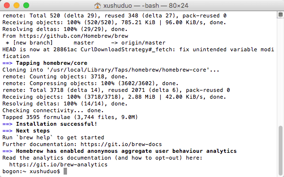
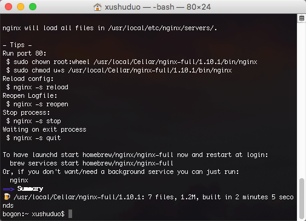
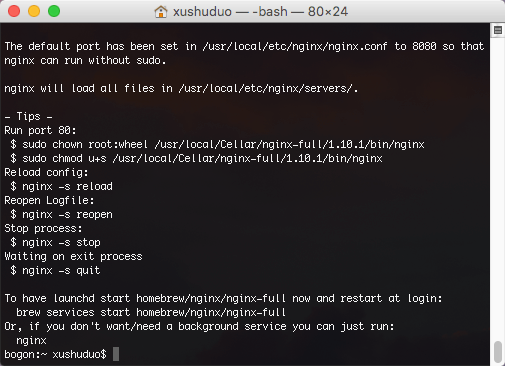
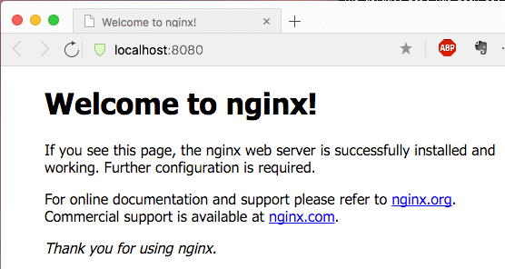
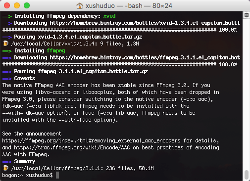

#MACOS上搭建nginx+rtmp环境

##1.安装Homebrow
已经安装了brow的可以直接跳过这一步。

查看是否安装：`brew -v`
 
安装命令：

```` ``` ````
ruby -e "$(curl -fsSL https://raw.githubusercontent.com/Homebrew/install/master/install)"
```` ``` ````

完成后检查版本`brew -v`,输出：



##2.安装Nginx
clone nginx到本地

`brew tap homebrew/nginx`

执行安装

`brew install nginx-full --with-rtmp-module`

安装过程比较缓慢，通过以上操作，nginx和rtmp就安装好了。


查询nginx安装地址：

`brew info nginx-full`



nginx安装所在位置：

`/usr/local/Cellar/nginx-full/1.10.1/bin/nginx`

配置文件所在位置：

`/usr/local/etc/nginx/nginx.conf`

##3.运行nginx

执行以下命令，测试是否能够启动服务：

`nginx`

端口占用，防火墙问题 导致无法启动，google一下。

在浏览器地址栏输入：`http://localhost:8080`
如果出现如下图，则代表nginx安装成功了


##4.配置rtmp
修改配置文件：

`/usr/local/etc/nginx/nginx.conf`

在配置文件最底部添加以下内容：

```` ``` ````
rtmp {
    server {
        listen 1935;
        #直播流配置
        application rtmplive {
            live on;
            #为 rtmp 引擎设置最大连接数。默认为 off
            max_connections 1024;
        }
        application hls{
            live on;
            hls on;
            hls_path /usr/local/var/www/hls;
            hls_fragment 1s;
        }
    }
}
```` ``` ````

配置完成后，重启nginx

`nginx -s reload`

##5.安装ffmepg工具

`brew install ffmpeg`

安装这个需要等待一段时间



##6.ffmpeg推流
准备一个视频文件来推流，再安装一个流媒体视频播放器。Mac下可以使用VLC.
修改以下代码视频路径，进行推流。注意修改视频地址

`ffmpeg -re -i /Users/xushuduo/Desktop/test.mp4 -vcodec libx264 -acodec aac -strict -2 -f flv rtmp://localhost:1935/rtmplive/room`

将视频推流到服务器后，打开VLC，然后file->open network->输入：

`rtmp://localhost:1935/rtmplive/room`

##7.总结
经过上面的步骤，如果你能在VLC通过地址看到测试视频，那么rtmp流媒体服务器就搭建完成了。
