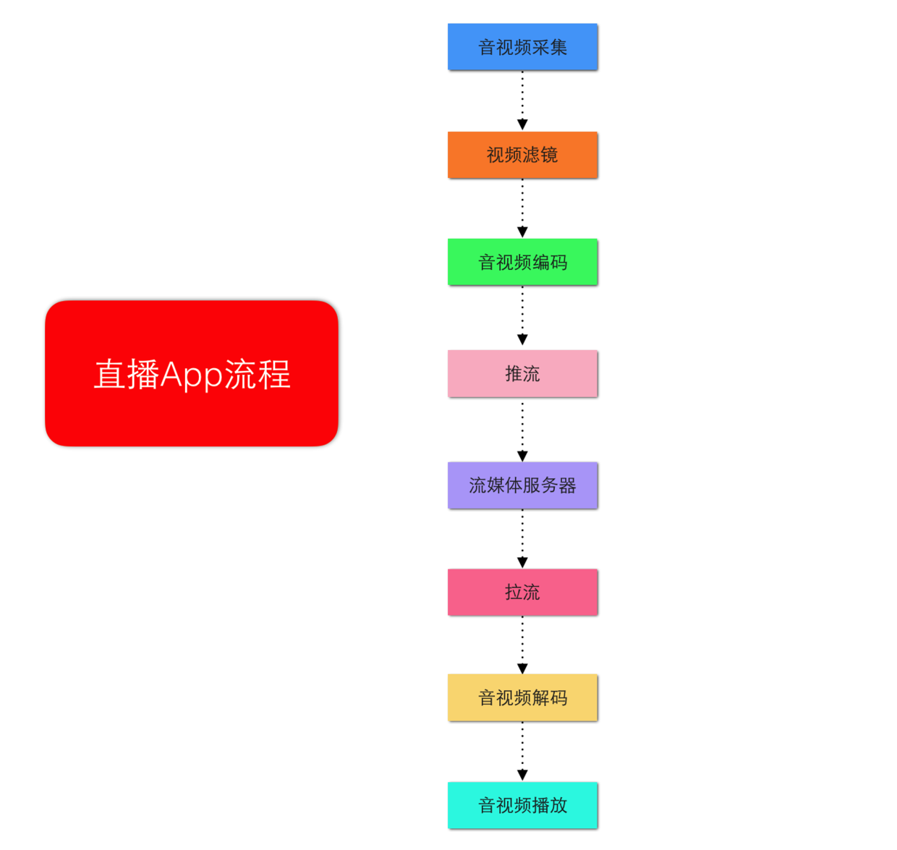
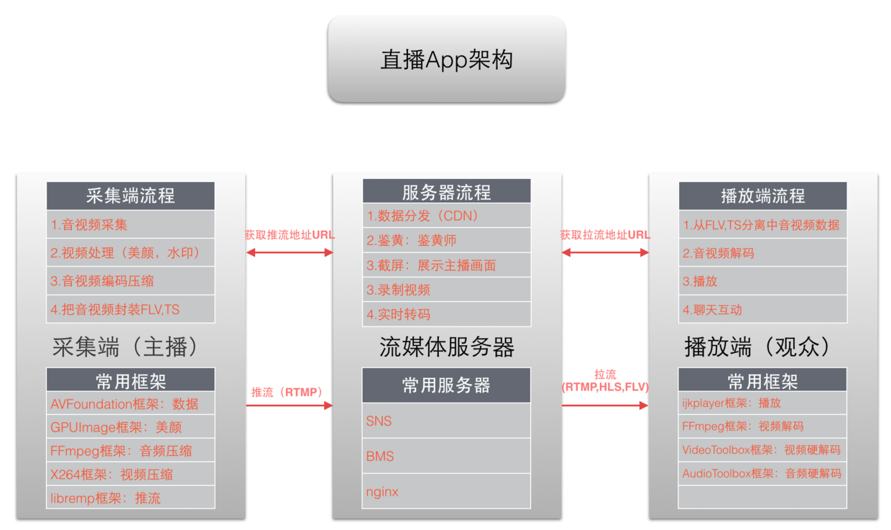

#这是一个提纲

##1.这里我还没想好
总之这里是要写点什么的。
###1.1 一个完整的直播APP原理
`直播原理` : 把主播录制的视频，推流送到服务器，服务器经过处理(鉴黄等),通过CDN分发给观众看。

`直播环节` : 推流端(采集、美颜、编码、推流)，服务端处理(转码、录制、截图、鉴黄)、播放器(拉流、解码、渲染)、互动系统(聊天室、礼物系统、赞)
###1.2 一个完整直播APP实现流程
`1.采集、2.滤镜处理、3.编码、4.推流、5.CDN分发、6.拉流、7.解码、8.播放、9.聊天互动`

###1.3 一个完整直播APP架构
`1.采集端、服务端、播放端`

###1.4 一个完整直播APP技术点

下面我们会选择一部分技术进行讲解。

`提示`：[总结不好 图看不清 请点这里](http://www.jianshu.com/p/bd42bacbe4cc)

##2. 视频采集
###2.1 基本知识介绍
`AVFundation` : 音视频数据采集需要用AVFundation框架

`AVCaptureDevice` : 硬件设备，包括麦克风、摄像头、通过该对象可以设置物理设备的一些属性。例如相机焦距，白平衡等

`AVCaptureDeviceInput` : 硬件输入对象，可以根据AVCaptureDevice创建对应的AVCaptureDeviceInput对象，用于管理硬件输入数据

`AVCaptureOutput` : 硬件输出对象，用于接收各类输出数据，通常使用对应的子类AVCaptureAudioDataOutput(声音数据输出对象), AVCaptureVideoDataOutput(视频输出对象)

`AVCaptureConnection` : 当把一个输入和输出添加到AVCaptureSession后。AVCaptureSession就会在输出、输出设备之间建立连接，而且通过AVCaptureOutput可以获得这个对象

`AVCaptureVideoPreviewLayer` : 相机拍摄预览图层，能实时查看相机效果。创建该对象需要指定对应的AVCaptureSession对象，因为AVCaptureSession包含输出数据，有视频数据才能显示。

`AVCaptureSession` : 协调输入与输出之间传递数据

###2.2 捕获音视频步骤
官方步骤：
> 1. 创建AVCaptureSession对象
> 2. 获取AVCaptureDevicel录像设备（摄像头），录音设备（麦克风）。只用于配置
> 3. 根据音频/视频硬件设备(AVCaptureDevice)创建音频/视频硬件输入数据对象(AVCaptureDeviceInput)，专门管理数据输入。
> 4. 创建视频输出数据管理对象（AVCaptureVideoDataOutput），并且设置样品缓存代理(setSampleBufferDelegate)就可以通过它拿到采集到的视频数据
> 5. 创建音频输出数据管理对象（AVCaptureAudioDataOutput），并且设置样品缓存代理(setSampleBufferDelegate)就可以通过它拿到采集到的音频数据
> 6. 将数据输入对象AVCaptureDeviceInput、数据输出对象AVCaptureOutput添加到媒体会话管理对象AVCaptureSession中,就会自动让音频输入与输出和视频输入与输出产生连接.
> 7. 创建视频预览图层AVCaptureVideoPreviewLayer并指定媒体会话，添加图层到显示容器layer中
> 8. 启动AVCaptureSession，只有开启，才会开始输入到输出数据流传输

不清楚可以看 : [官方文档](https://developer.apple.com/library/content/documentation/AudioVideo/Conceptual/AVFoundationPG/Articles/04_MediaCapture.html)

整理步骤：
>1.  创建AVCaptureDevice(video或者audio)
>2.  根据AVCaptureDevice创建AVCaptureDeviceInput。
>3.  创建AVCaptureSession
>4.  把创建的AVCaptureDeviceInput加入AVCaptureSession
>5.  添加视频预览图层AVCaptureVideoPreviewLayer
>6.  启动会话

###2.3 切换摄像头
###2.4 聚焦光标

###2.5 Demo在这里
Demo在这里 : [Demo](www.qq.com)
##3. 视频滤镜
###3.1 利用GPUImage处理直播过程中美颜流程
###3.2 处理画面原理
###3.3 美颜原理

##4. 音视频编码
### VideoToolBox
### AudioToolBox

##5. 推流
##6. 流媒体服务器
##7. 拉流
##8. 音视屏解码
##9. 音视频播放
