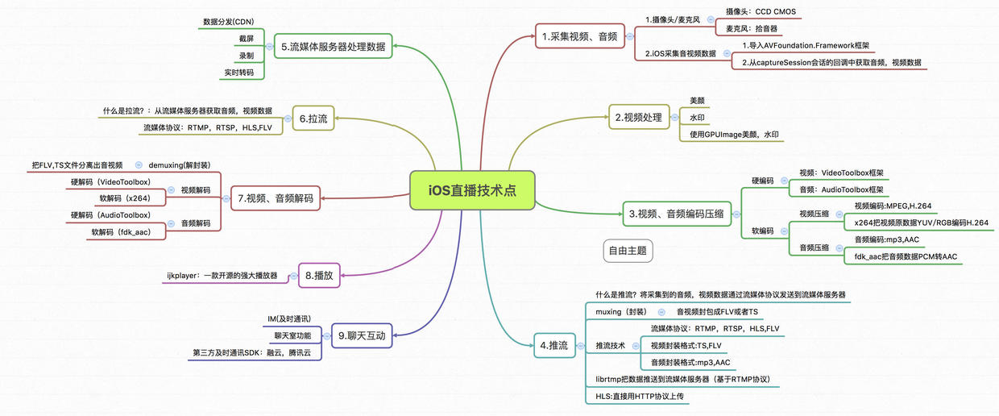
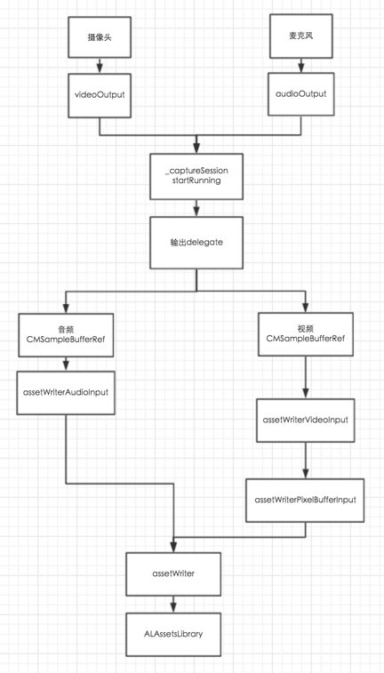
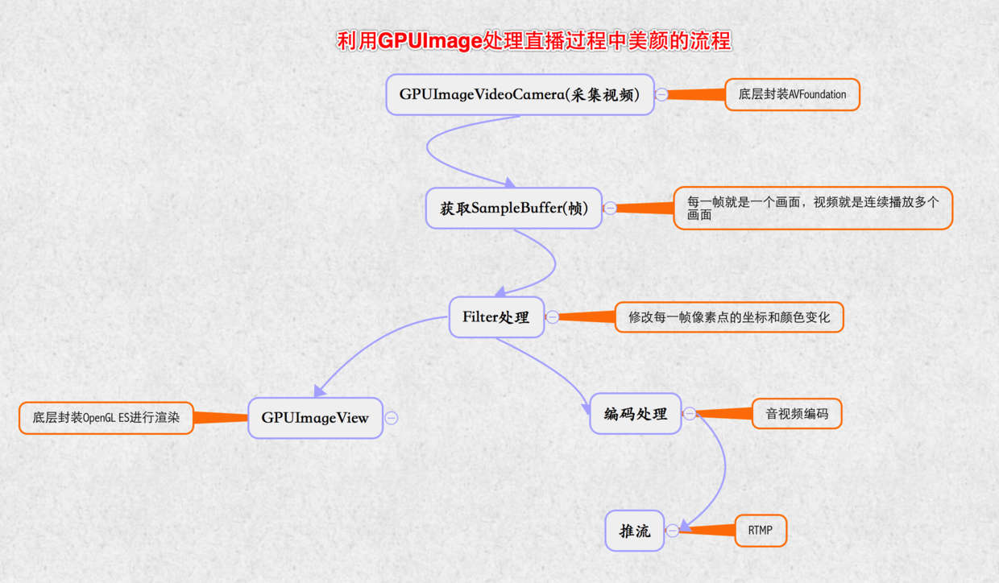
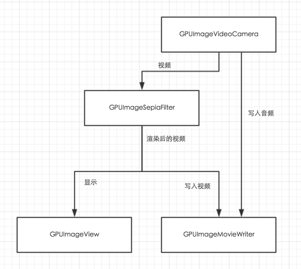

#这是一个提纲

##1.这里我还没想好
总之这里是要写点什么的。
###1.1 一个完整的直播APP原理
`直播原理` : 把主播录制的视频，推流送到服务器，服务器经过处理(鉴黄等),通过CDN分发给观众看。

`直播环节` : 推流端(采集、美颜、编码、推流)，服务端处理(转码、录制、截图、鉴黄)、播放器(拉流、解码、渲染)、互动系统(聊天室、礼物系统、赞)
###1.2 一个完整直播APP实现流程
`1.采集、2.滤镜处理、3.编码、4.推流、5.CDN分发、6.拉流、7.解码、8.播放、9.聊天互动`

###1.3 一个完整直播APP架构
`1.采集端、服务端、播放端`

###1.4 一个完整直播APP技术点


下面我们会选择一部分技术进行讲解。

`提示`：[总结不好 图看不清 请点这里](http://www.jianshu.com/p/bd42bacbe4cc)

##2. 视频采集
###2.1 基本知识介绍
`AVFundation` : 音视频数据采集需要用AVFundation框架

`AVCaptureDevice` : 硬件设备，包括麦克风、摄像头、通过该对象可以设置物理设备的一些属性。例如相机焦距，白平衡等

`AVCaptureDeviceInput` : 硬件输入对象，可以根据AVCaptureDevice创建对应的AVCaptureDeviceInput对象，用于管理硬件输入数据

`AVCaptureOutput` : 硬件输出对象，用于接收各类输出数据，通常使用对应的子类AVCaptureAudioDataOutput(声音数据输出对象), AVCaptureVideoDataOutput(视频输出对象)

`AVCaptureConnection` : 当把一个输入和输出添加到AVCaptureSession后。AVCaptureSession就会在输出、输出设备之间建立连接，而且通过AVCaptureOutput可以获得这个对象

`AVCaptureVideoPreviewLayer` : 相机拍摄预览图层，能实时查看相机效果。创建该对象需要指定对应的AVCaptureSession对象，因为AVCaptureSession包含输出数据，有视频数据才能显示。

`AVCaptureSession` : 协调输入与输出之间传递数据

###2.2 捕获音视频步骤
包含关系:


步骤:
>1.  创建AVCaptureDevice(video或者audio)
>2.  根据AVCaptureDevice创建AVCaptureDeviceInput。
>3.  创建AVCaptureSession
>4.  把创建的AVCaptureDeviceInput加入AVCaptureSession
>5.  添加视频预览图层AVCaptureVideoPreviewLayer
>6.  创建AVCaptureAudioDataOutput，并加入AVCaptureSession
>7.  启动会话

官方步骤(可以忽略)：
> 1. 创建AVCaptureSession对象
> 2. 获取AVCaptureDevice录像设备（摄像头），录音设备（麦克风）。只用于配置
> 3. 根据音频/视频硬件设备(AVCaptureDevice)创建音频/视频硬件输入数据对象(AVCaptureDeviceInput)，专门管理数据输入。
> 4. 创建视频输出数据管理对象（AVCaptureVideoDataOutput），并且设置样品缓存代理(setSampleBufferDelegate)就可以通过它拿到采集到的视频数据
> 5. 创建音频输出数据管理对象（AVCaptureAudioDataOutput），并且设置样品缓存代理(setSampleBufferDelegate)就可以通过它拿到采集到的音频数据
> 6. 将数据输入对象AVCaptureDeviceInput、数据输出对象AVCaptureOutput添加到媒体会话管理对象AVCaptureSession中,就会自动让音频输入与输出和视频输入与输出产生连接.
> 7. 创建视频预览图层AVCaptureVideoPreviewLayer并指定媒体会话，添加图层到显示容器layer中
> 8. 启动AVCaptureSession，只有开启，才会开始输入到输出数据流传输


其中`AVCaptureAudioDataOutput`、`AVCaptureVideoDataOutput`包含两个代理方法，可以一直监听捕获属性。

```
- (void)captureOutput:(AVCaptureOutput *)captureOutput didOutputSampleBuffer:(CMSampleBufferRef)sampleBuffer fromConnection:(AVCaptureConnection *)connection
{
    if (self.videoConnection == connection)
    {
        NSLog(@"采集到视频");
    }
    else if(self.audioConnection == connection)
    {
        NSLog(@"采集到音频");
    }
}

// 丢失帧会调用这里
- (void)captureOutput:(AVCaptureOutput *)captureOutput didDropSampleBuffer:(CMSampleBufferRef)sampleBuffer fromConnection:(AVCaptureConnection *)connection NS_AVAILABLE(10_7, 6_0)
{
    NSLog(@"丢失帧");
}
```

不清楚可以看 : [官方文档](https://developer.apple.com/library/content/documentation/AudioVideo/Conceptual/AVFoundationPG/Articles/04_MediaCapture.html)

###2.3 捕捉图片
`AVCaptureStillImageOutput`可以将捕获到的Video转换为图片。
> 1. 创建device
> 2. 根据device创建deviceInput
> 3. 添加deviceInput进session
> 4. 添加预览图层
> 5. 添加deviceOutput进session
> 6. 调用AVCaptureConnection生成图片
 
###2.4 捕捉视频
`AVCaptureMovieFileOutput` 可以将捕捉到的视频输出到磁盘。可以设置录制最长时限或录制到特定大小，还可以配置成保留最小可用磁盘空间。
> 1. 创建device
> 2. 根据device创建deviceInput
> 3. 添加deviceInput进session
> 4. 添加预览图层
> 5. 添加deviceOutput进session
> 6. 调用AVCaptureMovieFileOutput把视频写入文件

`AVCaptureMovieFileOutput`包含有几个代理方法。分别是`视频开始录制`,`视频暂停`,`视频恢复`, `视频将要录制完成`, `视频录制完成`。

#2.5 采集音频视频按帧输出流程解析
> 1.找到物理设备摄像头_inputCamera、麦克风_microphone，创建摄像头输入videoInput和麦克风输入audioInput；
> 
> 2.设置videoInput和audioInput为_captureSession的输入，同时设置videoOutput和audioOutput为_captureSession的输出，并且设置videoOutput和audioOutput的输出delegate；
> 
> 3._captureSession调用startRunning，开始捕获信号；
> 
> 4.音频数据到达，把数据转发给之前设置的audioEncodingTarget，并通过调用assetWriterAudioInput的appendSampleBuffer方法写入音频数据；
> 
> 5.视频数据到达，视频数据传入响应链，经过处理后通过assetWriterPixelBufferInput的appendSampleBuffer方法写入视频数据;
> 
> 6.选择保存后，文件通过ALAssertLibrary写入手机照片库。

流程图：



###2.6 Demo在这里
代码 : [Demo](www.qq.com)

##3. GPUImage
`前面好像没看懂，可以看这里吗？`

可以，GPUImage对AVFundation进行了一层封装，就算你不会前面的也没关系。
###3.1 基本概念
`GPU` 手机或者电脑用于处理图像渲染的硬件

`OpenGL ES` 一套图形与硬件接口，用于把处理好的图片显示到屏幕上。

`GPUImage` 是一个基于OpenGL ES 2.0图像和视频处理的开源iOS框架，提供各种各样的图像处理滤镜，并且支持照相机和摄像机的实时滤镜，内置120多种滤镜效果，并且能够自定义图像滤镜。

`GPUImage` 是一个基于OpenGL ES 2.0图像和视频处理的开源iOS框架，提供各种各样的图像处理滤镜，并且支持照相机和摄像机的实时滤镜，内置120多种滤镜效果，并且能够自定义图像滤镜。

`滤镜处理的原理` 就是把静态图片或者视频的每一帧进行图形变换再显示出来。它的本质就是像素点的坐标和颜色变化

###3.1 利用GPUImage处理直播过程中美颜流程
`采集视频 => 获取每一帧图片 => 滤镜处理 => GPUImageView展示`

###3.2 处理画面原理
GPUImage采用链式方式来处理画面,通过addTarget:方法为链条添加每个环节的对象，处理完一个target,就会把上一个环节处理好的图像数据传递下一个target去处理，称为GPUImage处理链。
一般的target可以分为两类：
`中间环节`的target，一般是指各种filter，是GPUImageFilter或者是子类

`最终环节`的target，GPUImageView 用于显示到屏幕上或者GPUImageMovieWriter写成视频文件。

主要分为三个环节：
`source(视频，图片源) => filter(滤镜) => final target(处理后的视频、图片)`

###3.3 美颜原理

###3.4 GPUImage源对象
GPUImage的数据源只能是4类：

`GPUImageVideoCamera` ios摄像头的实时美颜。GPUImageVideoCamera是GPUImageOutput的子类，提供来自摄像头的图像数据作为源数据，一般是响应链的源头。

`GPUImageStillCamera` 相机拍照

`GPUImagePicture` 处理静止图像

`GPUImageMovie` 电影 

###3.5 用法
>1. 创建过滤器
>2. 创建源对象
>3. 把过滤器添加到源对象
>4. 生成target

静态图片处理：

```
UIImage *inputImage = [UIImage imageNamed:@"105"];
    
// 创建过滤器
GPUImageBrightnessFilter *filter = [[GPUImageBrightnessFilter alloc] init];
filter.brightness = 0.5;
[filter forceProcessingAtSize:inputImage.size];
[filter useNextFrameForImageCapture]; // 告诉系统从后来捕获过滤器
    
// 处理静止的图像
GPUImagePicture *stillPic = [[GPUImagePicture alloc] initWithImage:inputImage];
[stillPic addTarget:filter]; //添加过滤器
[stillPic processImage]; // 执行渲染
    
UIImage *newImage = [filter imageFromCurrentFramebuffer];
    
UIImageView *imageView = [[UIImageView alloc] initWithImage:newImage];
[imageView sizeToFit];
[self.view addSubview:imageView];
 imageView.center = CGPointMake(CGRectGetWidth(self.view.frame)/2, CGRectGetHeight(self.view.frame)/2);
```

实时美颜处理:

```
// 创建视频源
GPUImageVideoCamera *videoCamera = [[GPUImageVideoCamera alloc] initWithSessionPreset:AVCaptureSessionPresetHigh cameraPosition:AVCaptureDevicePositionBack];
// 设置方向
videoCamera.outputImageOrientation = UIInterfaceOrientationPortrait;
    
// 创建预览View
GPUImageView *videoPreview = [[GPUImageView alloc] initWithFrame:self.view.bounds];
[self.view insertSubview:videoPreview atIndex:0];
    
 // 添加预览图层到源
GPUImageBeautifyFilter *fiter = [[GPUImageBeautifyFilter alloc] init];
[_videoCamera addTarget:fiter];
[fiter addTarget:self.videoPreview];
// 开始采集视频
[videoCamera startCameraCapture];

```

到这里，仅仅是屏幕显示的内容有滤镜效果，而作为直播应用，还需要输出带有美颜效果的视频流。
我们需要使用`GPUImageMovieWriter`类，才能处理视频流。

核心思路：

通过GPUImageVideoCamera采集视频和音频信息，音频信息直接发送给`GPUImageMovieWriter`，视频信息传入响应链作为源头，渲染后的视频再写入`GPUImageMovieWriter`，同时通过`GPUImageView`显示在屏幕上。




###3.6 实例代码在这里
[demo](这是一个demo地址)

##4. 音视频编码
### VideoToolBox
### AudioToolBox

##5. 推流
##6. 流媒体服务器
##7. 拉流
##8. 音视屏解码
##9. 音视频播放
