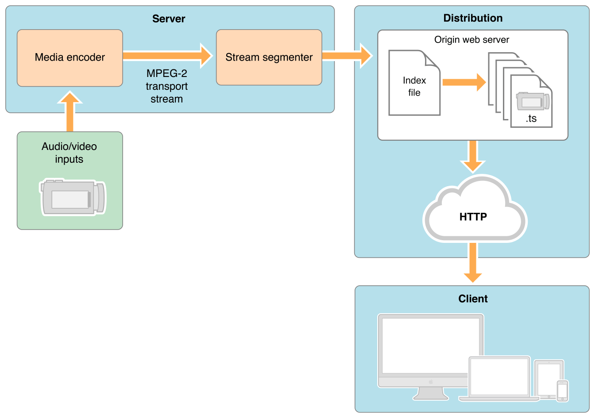

#直播协议的选择：RTMP vs. HLS

##前言
   随着直播业务的兴起，越来越多的直播平台开始涌现，这火热的程度好像一个应用不带上直播业务出来都不好意思跟人打招呼。想要做一个直播业务，主要包括三个部分：采集推流端、流媒体服务端、播放端。这里不多说，就主要结合 iOS 平台，从观看端出发，介绍一下对直播协议的选择。
   
通常在 iOS 平台做直播业务，会有两种协议可供选择：HLS 和 RMTP。

> 1. HLS，是苹果公司实现的基于 HTTP 的流媒体传输协议，全称 HTTP Live Streaming，可支持流媒体的直播和点播，主要应用在 iOS 系统，为 iOS 设备（如 iPhone、iPad）提供音视频直播和点播方案。
> 
> 2. RTMP，实时消息传输协议，Real Time Messaging Protocol，是 Adobe Systems 公司为 Flash 播放器和服务器之间音频、视频和数据传输开发的开放协议。协议基于 TCP，是一个协议族，包括 RTMP 基本协议及 RTMPT/RTMPS/RTMPE 等多种变种。RTMP 是一种设计用来进行实时数据通信的网络协议，主要用来在 Flash/AIR 平台和支持RTMP协议的流媒体/交互服务器之间进行音视频和数据通信。
> 

上面是这两种协议的简介，那它们在实际应用中会有什么差异呢？

##HLS
>先说说 HLS。HLS 的基本原理就是当采集推流端将视频流推送到流媒体服务器时，服务器将收到的流信息每缓存一段时间就封包成一个新的 ts 文件，同时服务器会建立一个 m3u8 的索引文件来维护最新几个 ts 片段的索引。当播放端获取直播时，它是从 m3u8 索引文件获取最新的 ts 视频文件片段来播放，从而保证用户在任何时候连接进来时都会看到较新的内容，实现近似直播的体验。相对于常见的流媒体直播协议，例如 RTMP 协议、RTSP 协议等，HLS 最大的不同在于直播客户端获取到的并不是一个完整的数据流，而是连续的、短时长的媒体文件，客户端不断的下载并播放这些小文件。这种方式的理论最小延时为一个 ts 文件的时长，一般情况为 2-3 个 ts 文件的时长。HLS 的分段策略，基本上推荐是 10 秒一个分片，这就看出了 HLS 的缺点：

>通常 HLS 直播延时会达到 20-30s，而高延时对于需要实时互动体验的直播来说是不可接受的。

>HLS 基于短连接 HTTP，HTTP 是基于 TCP 的，这就意味着 HLS 需要不断地与服务器建立连接，TCP 每次建立连接时的三次握手、慢启动过程、断开连接时的四次挥手都会产生消耗。

不过 HLS 也有它的优点：

>数据通过 HTTP 协议传输，所以采用 HLS 时不用考虑防火墙或者代理的问题。
>使用短时长的分片文件来播放，客户端可以平滑的切换码率，以适应不同带宽条件下的播放。
>HLS 是苹果推出的流媒体协议，在 iOS 平台上可以获得天然的支持，采用系统提供的 AVPlayer 就能直接播放，不用自己开发播放器。
>

##RTMP
相对于 HLS 来说，采用 RTMP 协议时，从采集推流端到流媒体服务器再到播放端是一条数据流，因此在服务器不会有落地文件。这样 RTMP 相对来说就有这些优点：
>延时较小，通常为 1-3s。
>基于 TCP 长连接，不需要多次建连。

因此业界大部分直播业务都会选择用 RTMP 作为流媒体协议。通常会将数据流封装成 FLV 通过 HTTP 提供出去。但是这样也有一些问题需要解决：
>iOS 平台没有提供原生支持 RTMP 或 HTTP-FLV 的播放器，这就需要开发支持相关协议的播放器。